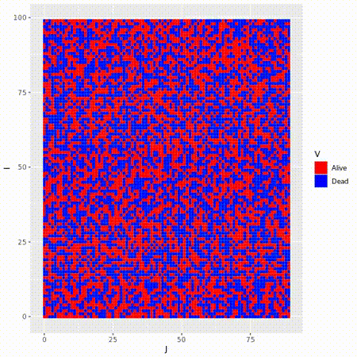

# GOL repository
A Solution to the Game Of Life (GOL) problem
# running cmd :
In a shell at the root of thisrepository use the following command:
make help
Or
cd Code && make help
# Dependencies
- Make
- g++ as c++ compiler (std17)
- R used to plot the GOL state
  

